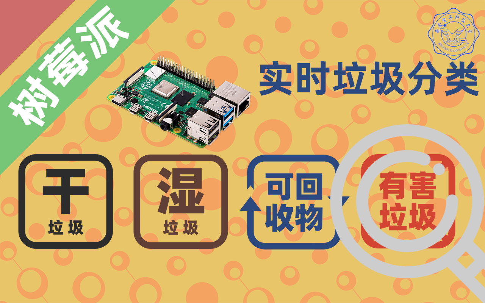

# 

## 一、项目概述

- 简介：该垃圾分类项目主要在于对各种垃圾进行所属归类，本次项目采用keras深度学习框架搭建卷积神经网络模型实现图像分类，最终移植在树莓派上进行实时视频流的垃圾识别。

- 前期：主要考虑PC端性能，并尽可能优化模型大小，训练可采用GPU，但调用模型测试的时候用CPU运行，测试帧率和准确性（测试10张左右图像的运行时间取平均值或实时视频流的帧率）。

- 后期：部署在树莓派端，在本地进行USB摄像头实时视频流的垃圾分类（归类）。

- 框架语言：  keras+python。

- PC端：

1. 系统：win10
2. 显卡：GTX 1060Ti训练，NVIDIA RTX 3070测试
3. 软件：VS Code & PyCharm
4. python环境：

```txt
tensorflow-gpu: 2.5.0
Keras: 2.6.0
Opencv: 4.0.1
Python: 3.8.10
Numpy:1.21.2
```

## 二、数据集

- data1: <https://www.kaggle.com/asdasdasasdas/garbage-classification>

数据集包含6个分类：cardboard (393), glass (491), metal (400), paper(584), plastic (472) andtrash(127).分为训练集90%(Train)和测试集10%(Test)

- data2: <https://www.kesci.com/home/dataset/5d133d11708b90002c570588>

该数据集是图片数据，分为训练集85%(Train)和测试集15%(Test)。其中O代表Organic(有机垃圾)，R代表Recycle(可回收)。

- data3: <https://copyfuture.com/blogs-details/2020083113423317484akwfwu4mzs89w>

一共 56528 张图片，214 类，总共 7.13 GB。分为训练集90%(Train)和测试集10%(Test)

- process

1. 由于一些图片损坏(PIL.Image读取错误), 获取原始数据集后，需要使用[remove_badimg.py](utils\remove_badimg.py)将损坏图片移除

2. 其中data1和data3没有进行训练集和测试集的分类, 所以使用[dataset_group.py](utils\dataset_group.py)将数据集分成训练集和测试集

## 三、AleNet5 模型搭建

本次项目采用深度学习来进行图像识别，如今深度学习中最流行的无疑是卷积神经网络，因此，我们搭建了包含5层卷积层的神经网络来进行垃圾分类。

由于本次项目包含三个数据集，对应三个类别（6分类，2分类，214分类），但是设计的模型都是一样的，因此，下面就以data2进行网络搭建、训练、测试讲解。


​
卷积神经网络实例

在正式训练之前我们还使用了数据增广技术（ImageDataGenerator）来对我们的小数据集进行数据增强（对数据集图像进行随机旋转、移动、翻转、剪切等），以加强模型的泛化能力。

```python
    train_datagen = ImageDataGenerator(
    rotation_range = 10, #随机旋转度数
    width_shift_range = 0.1, #随机水平平移
    height_shift_range = 0.1,#随机竖直平移
    rescale = 1/255, #数据归一化
    shear_range = 0.1, #随机裁剪
    zoom_range = 0.1, #随机放大
    horizontal_flip = True, #水平翻转
    fill_mode = 'nearest', #填充方式
    )
```

### 1、模型构建

```python
def AlexNet(label_num):
    model = Sequential()
    # input_shape = (64,64, self.config.channles)
    input_shape = input_shape=(128,128,3)
    model.add(Convolution2D(64, (11, 11), input_shape=input_shape,strides=(1, 1),  padding='valid',activation='relu', kernel_initializer='uniform'))
    model.add(MaxPooling2D(pool_size=(3, 3), strides=(2, 2)))#26*26
    model.add(Convolution2D(64, (5, 5), strides=(1, 1), padding='same', activation='relu', kernel_initializer='uniform'))
    model.add(MaxPooling2D(pool_size=(3, 3), strides=(2, 2)))
    model.add(Convolution2D(32, (3, 3), strides=(1, 1), padding='same', activation='relu', kernel_initializer='uniform'))
    model.add(Convolution2D(32, (3, 3), strides=(1, 1), padding='same', activation='relu', kernel_initializer='uniform'))
    model.add(Convolution2D(16, (3, 3), strides=(1, 1), padding='same', activation='relu', kernel_initializer='uniform'))
    model.add(MaxPooling2D(pool_size=(2, 2), strides=(2, 2)))
    model.add(Flatten())
    model.add(Dense(512, activation='relu'))
    model.add(Dropout(0.5))
    model.add(Dense(512, activation='relu'))
    model.add(Dropout(0.5))
    model.add(Dense(label_num, activation='softmax'))
    # model.compile(loss="categorical_crossentropy", optimizer="adam", metrics=["accuracy"])
    return model
```

其中conv2d表示执行卷积，maxpooling2d表示执行最大池化，Activation表示特定的激活函数类型，Flatten层用来将输入“压平”，用于卷积层到全连接层的过渡，Dense表示全连接层（128-128-6，最后一位表示分类数目）。

参数设置：为训练设置一些参数，比如训练的epoches，batch_szie，learning rate等

```python
    callbacks_list = [
    ModelCheckpoint(filepath, monitor='val_accuracy', verbose=1,save_best_only=True,mode='max',period=1)]
```

在这里我们使用了SGD优化器，由于这个任务是一个多分类问题，可以使用类别交叉熵(categorical_crossentropy)。但如果执行的分类任务仅有两类，那损失函数应更换为二进制交叉熵损失函数(binary cross-entropy)

### 2、模型保存

将神经网络在data2数据集上训练的结果(参数，权重文件)进行保存，方便后期调用训练好的模型进行预测。

模型保存文件名为: trash_data2_AlexNet3.h5， 我们设置为保存模型效果最好的一次。

```python
    model_AlexNet = AlexNet(len(train_generator.class_indices))
    model_AlexNet.summary()#输出模型网络结构
    filepath = model_save_path
    callbacks_list = [
    ModelCheckpoint(filepath, monitor='val_accuracy', verbose=1,save_best_only=True,mode='max',period=1)]
```

## 四、训练并测试

首先是观察数据，看看我们要识别的垃圾种类有多少，以及每一类的图片有多少。

### 1、训练结果

[train.py](code\train.py)已经写好了，接下来开始训练(图片归一化尺寸为128，batch_size为32，epoches为5000，一般5k就已经算比较多的啦，效果好的话可以提前结束)。

- 进行训练

```python
    model_AlexNet.compile(optimizer = SGD(lr=1e-4,momentum=0.9), loss = 'categorical_crossentropy', metrics = ['accuracy'])
    model_AlexNet.fit_generator(train_generator,epochs=5000,validation_data=test_generator, callbacks=callbacks_list)
```

### 2、模型保存

模型保存至[model](model)文件夹中

### 3、预测单张图片

现在我们已经得到了我们训练好的模型trash_data2_AlexNet3.h5，然后我们编写一个专门用于预测的脚本[test.py](code\test.py)

```python
    def predict_one_image(self,img_path):

        image = load_img(img_path)
        image = image.resize(self.imgsize)
        image = img_to_array(image)
        image = image/255
        image = np.expand_dims(image, 0)
        result = self.label[self.model.predict_classes(image)]
        return result

    def predict_dir_image(self,img_dir,label_name):
        imgs_name = os.listdir(img_dir)
        self.size=0
        hit_num=0
        print('########## Test Label: {} ##########'.format(label_name))
        start = time.process_time()
        for name in imgs_name:
            img_name = img_dir + name
            re = self.predict_one_image(img_name)
            self.size=self.size+1
            print(name+"：{}".format(re[0]))
            if re == label_name:
                hit_num = hit_num+1
        self.acc=hit_num/self.size
        end = time.process_time()
        self.period=end-start
        self.run_rate=self.period/self.size

    def img_test(self):
        csv_path=create_pre_csv(self.model_name)
        with open(csv_path,'a+',encoding='utf8',newline="") as csv_file:
            csv_write = csv.writer(csv_file)
            for i in self.label:
                self.predict_dir_image(self.test_path +i+'/',i)
                csv_write.writerows([(i,self.size,self.period,self.acc,self.run_rate)])
```

预测脚本中的代码编写思路是：载入训练好的模型->读入图片信息->预测->展示预测效果->写入[csv](code\trash_data2_AlexNet_predict_result.csv)文件->通过[excel](csv.xlsx)查看测试信息

#### 4、测试结果(data2)
Label,Size,Period,Accuracy,Run Rate
| Label       | Size        | Period      | Accuracy    | Run Rate    |
| ----------- | ----------- | ----------- | ----------- | ----------- |
| O           | 1401        | 40.75       | 0.9500356888| 0.0290863669|
| R           | 1112        | 29.96875    | 0.9190647482| 0.0269503147|

## 五、树莓派端部署/配置深度学习环境

**系统环境:2020-08-20-raspios-buster-armhf-full**

**工程要求：Tensorflow 1.14.0+ Keras 2.2.4 + Python 3.7**

### 1、配置好ssh和vnc之后，换源

第一步，先备份源文件

```sh
sudo cp/etc/apt/sources.list /etc/apt/sources.list.bak

sudo cp/etc/apt/sources.list.d/raspi.list /etc/apt/sources.list.d/raspi.list.bak
```

第二步，编辑系统源文件

```sh
sudo nano/etc/apt/sources.list
```

第三步，将初始的源使用#注释掉，添加如下两行清华的镜像源。Ctrl+O ++ Ctrl+X

【注意】这里的树莓派系统是Raspbian-buster系统，在写系统源链接时要注意是buster，网上很多教程都是之前stretch版本，容易出错！

```sh
deb http://mirrors.tuna.tsinghua.edu.cn/raspbian/raspbian/ buster main contribnon-free rpi

deb-src http://mirrors.tuna.tsinghua.edu.cn/raspbian/raspbian/ buster main contribnon-free rpi
```

第四步，保存执行如下命令sudo apt-get update，完成源的更新软件包索引。

```sh
sudo apt-get update&&upgrade
```

第五步，还需要更改系统源

```sh
sudo nano/etc/apt/sources.list.d/raspi.list
```

用#注释掉原文件内容，用以下内容取代：用#注释掉原文件内容，用以下内容取代：

```sh
deb http://mirrors.tuna.tsinghua.edu.cn/raspberrypi/ buster main ui

deb-src http://mirrors.tuna.tsinghua.edu.cn/raspberrypi/ buster main ui
```

第六步，配置换源脚本，更改pip源

新建文件夹：

```sh
mkdir ~/.pip

sudo nano ~/.pip/pip.conf
```

在pip.conf文件中输入以下内容：

```sh
[global]

timeout=100

index-url=https://pypi.tuna.tsinghua.edu.cn/simple/

extra-index-url=http://mirrors.aliyun.com/pypi/simple/

[install]

trusted-host=

        pypi.tuna.tsinghua.edu.cn

        mirrors.aliyun.com
```

### 2、python虚拟环境配置

首先进行系统软件包更新

```sh
sudo apt-get update

sudo apt-get upgrade

sudo rpi-update
```

然后更新自带的pip，由于Raspbian自带的pip3为9.0.1版本，较为老旧，我们使用以下命令来更新pip3：

```sh
python3 -mpip install --upgrade pip
```

尝试在更新完pip3后，键入命令：

```sh
pip3 list
```

新建个文件夹（虚拟环境用）

```sh
cd Desktop

mkdir tf_pi

cd tf_pi
```

安装虚拟环境这个好东西

```sh
python3 -mpip install virtualenv
```

增加环境变量，使得该好东西可以用起来

```sh
sudo chmod -R777 /root/.bashrc

sudo nano ~/.bashrc
```

把exportPATH=/home/pi/.local/bin/:$PATH  放到最后,添加环境变量

```sh
source ~/.bashrc
```

成功了之后：整一个虚拟环境

```sh
virtualenv env

source env/bin/activate
```

3、安装tensorflow1.14.0

用电脑下载：（链接）python3.7版本只能安装1.14.0-Buster版本的TensorFlow

<https://github.com/lhelontra/tensorflow-on-arm/releases/tag/v1.14.0-buster>


用U盘将这个文件拷到树莓派上，建一个bag文件夹存放

安装依赖包：

```sh
sudo aptinstall libatlas-base-dev
```

安装一些环境

```sh
sudo apt-get install -y libhdf5-dev libc-ares-dev libeigen3-dev

python3 -mpip install keras_applications==1.0.8 --no-deps

python3 -mpip install keras_preprocessing==1.1.0 --no-deps

python3 -mpip install h5py==2.9.0

sudo apt-get install -y openmpi-bin libopenmpi-dev

sudo apt-get install -y libatlas-base-dev

python3 -mpip install -U six wheel mock
```

### 3、安装tensorflow

```sh
cd env

cd bag

pip3 install tensorflow-1.14.0-cp37-none-linux_armv7l.whl
```


测试是否成功并查看版本：

```sh
python

import tensorflow as tf

tf.version
```


### 4、安装keras

1. 安装一些依赖

```sh
sudo apt-get install libhdf5-serial-dev

pip3 install h5py

sudo apt-get install gfortran

sudo apt install libopenblas-dev

pip3 install -i https://pypi.tuna.tsinghua.edu.cn/simple/ pillow

sudo pip3 install pybind11
```

2. [scipy](https://mirrors.tuna.tsinghua.edu.cn/pypi/web/packages/aa/d5/dd06fe0e274e579e1dff21aa021219c039df40e39709fabe559faed072a5/scipy-1.5.4.tar.gz)

```txt
先下载这个链接复制到树莓派上，然后解压到指定文件夹/home/pi/Work/tf_pi/env/lib/python3.7/site-packages下
```

```sh
cd /home/pi/Work/tf_pi/bag
```

tar -zxvf scipy-1.5.4.tar.gz-C /home/pi/Work/tf_pi/env/lib/python3.7/site-packages

```txt
然后进到这个文件夹里开启安装：【花里胡哨的各种代码配置呀啥的，会安装三十分钟左右】
```

```sh
cd /home/pi/Work/tf_pi/env/lib/python3.7/site-packages/scipy-1.5.4
python setup.py install
```


3. keras

```sh
pip3 install keras==2.2.4
```

请注意；由于在virtualenv里面，一定一定要避免sudo pip3 install，否则会安装到默认路径下！发现keras安装到默认环境了，所以调用不成功，pip list没有

安装好了之后记得reboot重启一下子。

### 5、测试

**因为keras可以配合很多框架，我们用的tf所以会有backend的提示，import keras前面加import os就能忽略提示**

**进入虚拟环境：**

```sh
cd ~/Work/tf_pi

source env/bin/activate
```

```sh
python

import tensorflowas tf

tf.__version__

import keras

print(keras.__version__)
```


## 六、用树莓派跑分类识别的代码

**系统环境：[2021-05-07-raspios-buster-armhf-lite](https://mirrors.tuna.tsinghua.edu.cn/raspberry-pi-os-images/raspios_lite_armhf/images/raspios_lite_armhf-2021-05-28/)**

**工程要求：Tensorflow 1.14.0+ Keras 2.2.4 + Python 3.7**


### 1、把代码还有图片集，拷到树莓派上


#### 2、激活虚拟环境

```sh
cd ~/Work/tf_pi

source env/bin/activate
```

### 3、克隆代码并进入代码目录

克隆代码

```sh
cd ~/DWorkesktop/tf_pi/env

git clone https://gitee.com/yangkun_monster/raspberrypi-Garbage-classification.git

```

若提示git命令未找到：

`sudo apt-get install git`

进入代码目录：

```sh
cd ~/Work/tf_pi/Garbage-Classification/code1
```

这里更改test.py的测试集路径

```sh
python test.py
```


发现有个文件解码有问题，于是根据错误的消息的路径，去这里：

```sh
/home/pi/Desktop/tf_pi/env/lib/python3.7/site-packages/keras/engine
```


在.decode('utf-8')前面加.encode('utf8')


再次到测试这里运行python test.py，解决了!


**测试AlexNet需要把test.py文件里的权重文件路径改了，把输入图片维度由(150,150) 改为(128,128)**


## 七、树莓派安装opencv并测试视频接口

**系统环境：2020-08-20-raspios-buster-armhf-full**

**工程要求：opencv 3.4.6.27**

```sh
cd ~/Work/tf_pi
source env/bin/activate
```

```sh
cd ~/DeWorksktop/tf_pi/env/laji/code1
python data1_video_test.py
```

### 1、安装必要的库

```sh
pip3 install numpy

sudo apt-get install libhdf5-dev -y build-dep libhdf5-dev

sudo apt-get install libatlas-base-dev -y

sudo apt-get install libjasper-dev -y

sudo apt-get install libqt4-test -y

sudo apt-get install libqtgui4 -y

sudo apt install libqt4-test

pip3 install libqtgui4


sudo apt-get install cmake

sudo apt  installcmake-qt-gui

sudo apt-get install libgtk2.0-dev

sudo apt-get install pkg-config


pip3 install boost

pip3 install dlib
```

### 2、电脑浏览器下载以下两个文件

[opencv_contrib_python](https://www.piwheels.org/simple/opencv-contrib-python/opencv_contrib_python-3.4.6.27-cp37-cp37m-linux_armv7l.whl)

[opencv_python](https://www.piwheels.org/simple/opencv-python/opencv_python-3.4.6.27-cp37-cp37m-linux_armv7l.whl)

### 3、将两个文件拷贝到树莓派上去


#### 4、安装这两个文件，先更新pip

```sh
pip install --upgrade pip
```

注意，由于是虚拟环境，就不能做sudo，会安装到默认路径

```sh
cd bag

pip3 installopencv_contrib_python-3.4.6.27-cp37-cp37m-linux_armv7l.whl

pip3 install opencv_python-3.4.6.27-cp37-cp37m-linux_armv7l.whl
```

### 5、测试

先打开摄像头设置

```sh
sudo raspi-config
```

然后运行摄像头程序


